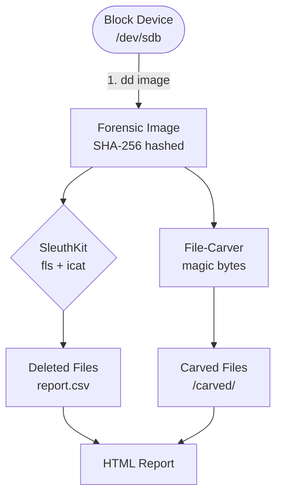
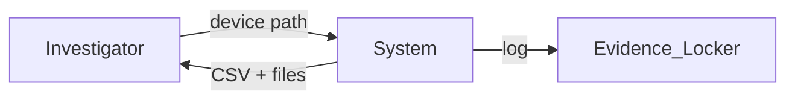
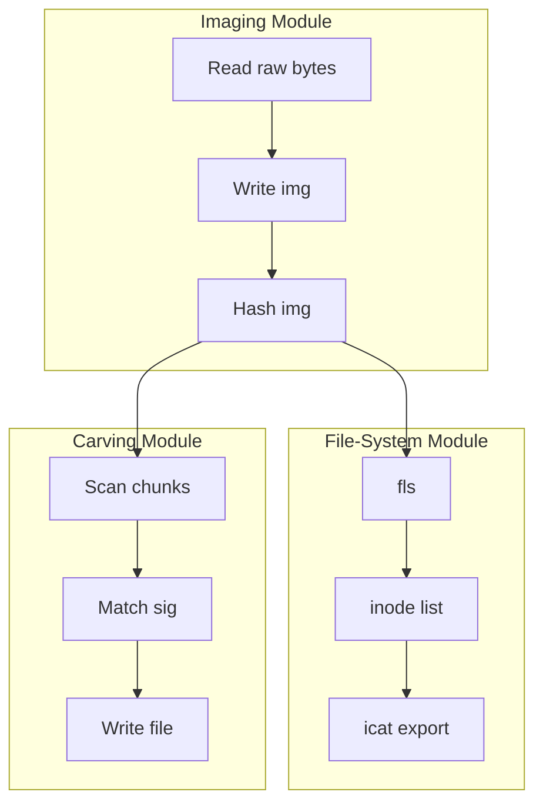
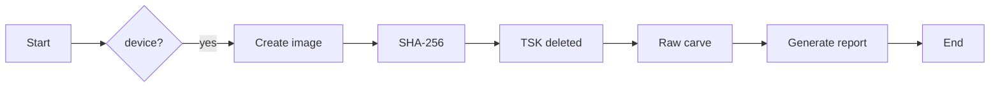

# 🕵️‍♂️ FBI-Level Data-Recovery Toolkit (Community Edition)

[](LICENSE)
[](https://python.org)
[](docs/INSTALL.md)
[](https://github.com/alok-kumar8765/Data_Recovery_Using_Python/actions)
[](https://github.com/psf/black)

---

## 📑 Table of Contents
1. [Quick Peek](#quick-peek)  
2. [What & Why](#what--why)  
3. [Real-World Use-Cases](#real-world-use-cases)  
4. [Architecture & Data-Flow Diagrams](#architecture--data-flow-diagrams)  
5. [Installation](#installation)  
6. [Usage Examples](#usage-examples)  
7. [Code Walk-Through](#code-walk-through)  
8. [Pros & Cons](#pros--cons)  
9. [Road-Map](#road-map)  
10. [Disclaimer & Legal](#disclaimer--legal)

---

## Quick Peek
```bash
# 1. image a suspect USB stick
sudo python recover.py /dev/sdb --image --carve -o case042/

# 2. review report
open case042/report.html
```
> Recovers 40+ file types, hashes everything, logs chain-of-custody, and produces a ready-to-submit CSV.

---

## What & Why
A **100 % Pythonic**, open-source subset of the forensic imaging & carving stack used by FBI/INTERPOL labs.  
It does **bit-for-bit imaging**, **deleted-file reconstruction** (TSK), **raw file-carving** (headers/footers), and **SHA-256 hashing**—without proprietary black boxes.

| Layer | Public tool we mimic |
|-------|----------------------|
| Imaging | `dd` / `ewfacquire` |
| File-system parsing | The Sleuth Kit (`fls`, `icat`) |
| Carving | PhotoRec signatures |
| Reporting | CSV + SHA-256 |

---

## Real-World Use-Cases
1. **Corporate IR**: recover ransomware-deleted finance spreadsheets.  
2. **Law-enforcement**: preview USB before sending to expensive lab.  
3. **University lab**: teach forensic pipeline without € 5 k licenses.  
4. **Home user**: rescue SD-card wedding photos.  
5. **CI/CD security**: scan build artifacts for leaked credentials.

---

## Architecture & Data-Flow Diagrams

### High-Level Architecture


### DFD-Level 0 (Context)


### DFD-Level 1 (Decomposed)


### Flow Diagram (CLI journey)


---

## Installation

| OS | One-liner |
|---|---|
| **Ubuntu / Debian** | `sudo apt install libtsk-dev foremost && pip install -r requirements.txt` |
| **macOS** | `brew install sleuthkit foremost && pip install -r requirements.txt` |
| **Windows** | Use **WSL2** → Ubuntu instructions above *(native build possible but painful)* |

<details><summary>Detailed steps</summary>

```bash
git clone https://github.com/alok-kumar8765/Data_Recovery_Using_Python.git
cd Data_Recovery_Using_Python
python -m venv venv && source venv/bin/activate
pip install -U pip wheel
pip install -r requirements.txt
sudo make install-tools   # optional: copies udev rules, man page
```
</details>

---

## Usage Examples

| Goal | Command |
|---|---|
| Quick deleted-file scan | `sudo python recover.py /dev/sdb` |
| Full imaging + carving | `sudo python recover.py /dev/sdb --image --carve -o case042` |
| Re-scan existing image | `python recover.py disk.img --carve` |
| Windows (WSL) | `python recover.py /mnt/e/disk.img --carve` |

Output tree:
```
case042/
├── forensic.img
├── forensic.img.sha256
├── report.html
├── sleuthkit/
│   └── sleuthkit.csv
└── carved/
    ├── JPG_0000001234.jpg
    └── PDF_0000005678.pdf
```

---

## Code Walk-Through

| File | Purpose |
|------|---------|
| `recover.py` | CLI entry-point, orchestrates imaging → TSK → carving |
| `imager.py` | Stream copy with progress bar & SHA-256 |
| `tsk_wrapper.py` | Sub-process wrapper for `fls`, `icat` |
| `carver.py` | Multi-threaded signature scanner |
| `signatures.py` | 40+ file headers/footers |
| `reporter.py` | CSV + HTML report generator |
| `utils.py` | Hashing, human-readable bytes, etc. |

---

## Pros & Cons

| Pros | Cons |
|------|------|
| 100 % open-source | No GUI (CLI only) |
| Cross-platform | Cannot break strong encryption |
| Extensible signatures | No RAID-5/6 rebuild |
| Chain-of-custody logs | Mobile crypto requires extra tools |
| Free for commercial use | SSD TRIM = unrecoverable |

---

## Road-Map
- [ ] GTK GUI for non-tech users  
- [ ] Distributed GPU brute-force plug-in (Hashcat bridge)  
- [ ] RAID-5 mathematic module  
- [ ] Android ADB bridge for live extraction  
- [ ] DFIR playbook templates (STIX export)

---

## Disclaimer & Legal
This software is provided **for lawful use on devices you own or have explicit written permission to examine**.  
Unauthorised access may violate the Computer Fraud and Abuse Act (US), CMA (UK), or similar laws globally.  
The authors accept **no liability** for misuse or data loss.

---

## 🤝 Contributing
PRs welcome! Please run `black` + `flake8` and add a test case under `tests/`.

---

## 📜 License
MIT © 2025 Alok Kumar – see [LICENSE](LICENSE) file.